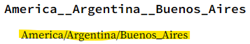

# clockery (rust)

A fully rewritten Clockery in Rust programming language for performance boost and fun reasons

## Preparation

### Linux

Install `libpng-dev`, `libsdl2-dev`, `libsdl2-ttf-dev`

### Windows

You have to follow this [guide](https://github.com/Rust-SDL2/rust-sdl2?tab=readme-ov-file#windows-msvc) and have Microsoft Build Tools installed.

## Building

### Building on Windows

1. `cargo install cargo-vcpkg`
2. `cargo vcpkg -v build`
3. `cargo build -r`

### Building on Linux

Install dependencies in [Preparation][#Preparation]

1. `cargo build -r`

Windows does statically link the binary but I am NOT too sure with Linux's.

## Usage

Either run the binary and it will create config.json for you to configure things about it.

It should looks like this

```json
{
    "am_pm": true,
    "clocks": [
        "local"
    ],
    "revert": false,
    "snow_enable": true,
    "snow_limit": 200
}
```

- `am_pm` is a bool where it either shows time in 24 hours format OR 12 hours format. (Thanks [Poiuu](https://twitter.com/PoiuuShho) for suggestion) Can be either enabled or disabled with `A` key.  
- `clocks` is a list of strings where those strings must be a timezone names, please select from [this](https://docs.rs/chrono-tz/latest/chrono_tz/enum.Tz.html)  
You MUST type the highlighted part  
  
- `revert` is a bool where it either revert all colors in the program. (kinda like light/dark mode) Can be either enabled or disabled with `R` key.  
- `snow_enable` is a bool where will it shows the "snow" particles falling from the top of the screen and limits based on `snow_limit`. Can be either enabled or disabled with `S` key.
- `snow_limit` is an integer where it will limit amount of snows shown on the screen. Mind you that this will be equally divded by amount of clocks, so if this value is set for `200` and there's 4 clocks to show it would be `200 / 4 = 50 snows per clock surface`

## Special Keybinds

`Escape` and `CTRL+C` will close the program and save the configuration to disk.  
`Q` will reload configuration off the disk.

## CLI

Run `./opengl_clockery -h` for help information.

- `-f`, `--fps <FPS></FPS>` is for limiting FPS. Defaults to unlimited.
- `-l`, `--list-gpu-renderers` is for listing all GPU rendering backends.
- `-s`, `--selected-gpu-renderer <SELECTED_GPU_RENDERER>` is for selecting a GPU rendering backend. It is optionally and this flag is only for you to enforce which GPU renderer you wanted.
